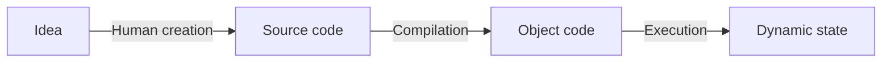

# CPSC 213: Introduction to Computer Systems

## Unit 1b: Static Scalars and Arrays

- **Course**: CPSC 213
- **Institution**: University of British Columbia (UBC)
- **Semester**: 2024W1

### Course Information
- **Title**: Introduction to Computer Systems
- **Unit**: 1b - Static Scalars and Arrays

### Credits
- Slides adapted from materials by:
  - Mike Feeley
  - Jonatan Schroeder
  - Robert Xiao
  - Jordon Johnson

### Instructors
- Mike Feeley
- Jonatan Schroeder
- Robert Xiao
- Jordon Johnson
- Geoffrey Tien

---

> UBC Motto: 'a place of mind'

*Note: This appears to be an introductory slide for a computer science course at UBC, focusing on fundamental concepts of computer systems.*
# Announcements

## Google doc for lecture questions

- See Canvas for link (Modules -> Resources)
- [Google Doc Link](https://docs.google.com/document/d/1wxjVBLQbLmbRLXrTAzygaPMhovRsYJsETHP_yEU-9o8/edit)

### Instructions:
- Add your question anonymously (at the top)
- Help answer questions too!

---

*2024W1 | Mike Feeley, Jonatan Schroeder, Robert Xiao, Jordon Johnson, Geoffrey Tien*
# Overview

## Reading
- Companion: 1, 2.1-2.3, 2.4.1-2.4.3
- Textbook: 3.1-3.2.1
- Reference (textbook, as needed): 3.1-3.5, 3.8, 3.9.3

## Learning objectives:
1. List basic components of a simple computer and describe their function
2. Describe ALU functionality (inputs/outputs)
3. Describe data exchange between ALU, registers, and memory
4. Identify and describe basic components of a machine instruction
5. Outline RISC machine steps for arithmetic on memory-stored numbers
6. Outline simple CPU instruction processing steps
7. Translate between array-element offsets and indices
8. Distinguish static/dynamic computation for global scalars/arrays in C
9. Translate C and assembly for global scalars/arrays access
10. Translate C and assembly for simple arithmetic
11. Explain difference between arrays in C and Java

2024W1 | Mike Feeley, Jonatan Schroeder, Robert Xiao, Jordon Johnson, Geoffrey Tien
# Our approach

## Develop a model of computation
- Rooted in what the machine actually does
- Examine C bit-by-bit (comparing to Java as we go)

## The processor
- Design and implement a **simple instruction set**
- Based on what's needed to compute C programs
- Similar to a real instruction set (MIPS)

## The language
- Act as compiler to translate C into machine language/assembly
- Bit by bit, then combining bits for interesting operations
- Edit, debug, and run using simulated processor to visualize execution

---
*2024W1 | Mike Feeley, Jonatan Schroeder, Robert Xiao, Jordon Johnson, Geoffrey Tien*
# The CPU

- CPUs execute **instructions**, not C or Java code
- Execution proceeds in **stages**:
  1. **Fetch**: load the next instruction from memory
  2. **Decode**: figure out from the instruction what needs to be done
  3. **Execute**: do what the instruction specifies
  - *Note: There can be more or fewer stages depending on model/implementation (CPSC 121, 313)*

- These stages are looped over and over again **forever**

*2024W1 - Mike Feeley, Jonatan Schroeder, Robert Xiao, Jordon Johnson, Geoffrey Tien*
# CPU Instructions

## Basic Instructions
- CPU instructions are **very simple**
  - Read (**load**) a value from memory
  - Write (**store**) a value to memory
  - Add/subtract/AND/OR/etc. two numbers
  - Shift a number
  - Control flow (see these in unit 1d)

## ALU Operations
- Some operations carried out by ALU (Arithmetic & Logic Unit)
  - ALU used in the **execute** stage

---
*Source: 2024W1 - Mike Feeley, Jonatan Schroeder, Robert Xiao, Jordon Johnson, Geoffrey Tien*
# Phases of Computation

## Key Phases
1. **Human creation**: Design program and describe it in high-level language
2. **Compilation**: Convert high-level human description into machine-executable text
3. **Execution**: A physical machine executes the code text

## Process Flow


- **Idea**: Starting point
- **Source code**: Result of human creation
- **Object code**: Result of compilation
- **Dynamic state**: Result of execution

---
*Note: Image from 2024W1 course by Mike Feeley, Jonatan Schroeder, Robert Xiao, Jordon Johnson, Geoffrey Tien*
# Static vs Dynamic Computation

## Execution
- Parameterized by input values **unknown** at compilation
- Producing output values that are **unknowable** at compilation

## Key Concepts
- **Static**: Anything the compiler can compute
- **Dynamic**: Anything that can only be discovered during execution

## Program Lifecycle
1. **Idea** (Human creation)
2. **Source code** (Compilation)
3. **Object code** (Execution)
4. **Dynamic state**

---
*2024W1 | Mike Feeley, Jonatan Schroeder, Robert Xiao, Jordon Johnson, Geoffrey Tien*
# iClicker 1b.1

## Code Analysis

```c
int a;
a = 5;
```

### Question
The value assigned to variable a is:

A. static
B. dynamic
C. neither static nor dynamic
D. it depends

### Answer
**A. static**

#### Explanation:
- The value 5 is directly assigned to variable `a`
- This is a compile-time constant
- No runtime calculation or input involved
- Therefore, it's a static assignment

### Key Concepts:
- **Static assignment**: Value known at compile time
- **Dynamic assignment**: Value determined at runtime
- In this case, 5 is hardcoded, making it static
# iClicker 1b.2

## Question
Assume that a variable of type `int` is assigned a value that is read from the user through an input dialog.

This value is:
- A. static
- B. dynamic
- C. neither static nor dynamic
- D. it depends

## Answer
The correct answer is **B. dynamic**.

### Explanation
- When a value is read from user input, it's determined at runtime.
- User input creates dynamic values that can change with each program execution.
- Static values are fixed and known at compile time, unlike user-provided data.

## Key Concept
- **Dynamic values**: Determined during program execution
- **Static values**: Fixed and known before the program runs
# The processor (CPU)

- Implements a set of **instructions**
- Each instruction is implemented using **logic gates**
  - Built from **transistors**: fundamental mechanism of computation
  - (Recall your CPSC 121 labs)

## Instruction design philosophies

- **RISC**: fewer and simpler instructions makes processor design simpler
- **CISC**: having more types of instructions (and more complex instructions) allows for shorter/simpler program code and simpler compilers

---
*2024W1 | Mike Feeley, Jonatan Schroeder, Robert Xiao, Jordon Johnson, Geoffrey Tien*
# First Proposed Instruction: ADD

## Instruction Definition
- A ← B + C
- A, B, C stored in memory

## Instruction Parameters
- Addresses of A, B, C
- Each address: 32 bits (64 bits in modern computers)

## Instruction Encoding
- Sequence of bits stored in memory
- Components:
  1. Operation name (e.g., add)
  2. Addresses for A, B, C

### Memory Occupation
- At least 13 bytes in memory

## Encoding Example
| Operation | Address of A | Address of B | Address of C |
|:---------:|:------------:|:------------:|:------------:|
|    01     |   00001024   |   00001028   |   0000102c   |

**Note:** This instruction demonstrates basic computer architecture concepts, including memory addressing and instruction encoding.
# Improving the ADD instruction

## Problems with memory access

### Accessing memory is SLOW
- ~100 CPU cycles for every memory access
- Goal: fast programs that avoid accessing memory when possible

### Big instructions are costly
- Memory addresses are big (so instructions that use them are big)
- Big instructions lead to big programs
- Reading instructions from memory is slow (fewer caching options)
- Large instructions use more CPU resources (transfer, storage)

---
*Note: 2024W1 | Mike Feeley, Jonatan Schroeder, Robert Xiao, Jordon Johnson, Geoffrey Tien*
# General Purpose Registers

## Register File
- Small, fast memory stored in CPU itself
- Roughly single-cycle access

## Registers
- Each register named by a number (e.g., 0-7)
  - Some may be used for other purposes
- Size: architecture's common integer (32 or 64 bits)

## CPU-Memory Interaction
```
[CPU (with Regs)] <---> [Memory]
```
- CPU contains registers
- Bidirectional data flow between CPU and Memory

---
*Source: 2024W1 - Mike Feeley, Jonatan Schroeder, Robert Xiao, Jordon Johnson, Geoffrey Tien*
# Instructions using registers

## Improving our ADD instruction

### Let's modify our instruction design

- Memory instructions handle only memory
  - Load data from memory into a register (slow)
  - Store data from register into memory (slow)

- Other instructions access data in registers
  - small and fast

- To further improve instruction size: share register for one source and the destination

### Instruction Format

1. Original format:
   ```
   01 | 00001024 | 00001028 | 000102c
   ```

2. Improved format:
   ```
   01 | 0 | 1 | 2
   ```
   - Operation | dest. reg | src. reg 1 | src. reg 2

3. Further improved format:
   ```
   01 | 0 | 1
   ```
   - Operation | dest. reg / src. reg 1 | src. reg 2

---

2024W1 | Mike Feeley, Jonatan Schroeder, Robert Xiao, Jordon Johnson, Geoffrey Tien | 15
# Special Purpose Registers

- Characteristics:
  - Used only for specific purposes
  - Physically separate from general-purpose register file
  - May have limited instruction accessibility
  - Can have special meaning or CPU treatment

## Examples

- **PC (Program Counter)**
  - Contains address of next instruction to execute

- **IR (Instruction Register)**
  - Contains recently fetched machine instruction from memory

---
*Note: 2024W1 | Mike Feeley, Jonatan Schroeder, Robert Xiao, Jordon Johnson, Geoffrey Tien*
# Instruction Set Architecture (ISA)

## Definition
- ISA is a **formal interface** to a processor implementation
  - Defines instructions the processor implements
  - Defines format of each instruction

## Types of Instructions
1. Math and logic
2. Memory access
3. Control transfer: "goto" and conditional "goto"

---
*Source: 2024W1 - Mike Feeley, Jonatan Schroeder, Robert Xiao, Jordon Johnson, Geoffrey Tien*
# ISA Design

## Design Alternatives
- **CISC**: Simplify compiler design (e.g. Intel x86, x86-64)
- **RISC**: Simplify processor implementation

## Instruction Format
- Sequence of bits: *opcode* and *operand* values
- All represented as *numbers* (in binary / hex)

## Assembly Language
- Symbolic (textual) representation of machine code

---
*2024W1 | Mike Feeley, Jonatan Schroeder, Robert Xiao, Jordon Johnson, Geoffrey Tien | 18*
# Representing Instruction Semantics

## RTL (Register Transfer Language)
- Simple, convenient **pseudo language** to describe semantics
- Easy to read/write, describes machine steps

## Syntax
- Format: `LHS ← RHS`
- LHS: memory or register receiving value
- RHS: constant, memory, register, or expression on two registers
- `m[a]`: memory at address a
- `r[i]`: register with number i

> Register file and memory are treated as arrays

2024W1 | Mike Feeley, Jonatan Schroeder, Robert Xiao, Jordon Johnson, Geoffrey Tien | 19
# RTL Examples

## Register Operations

1. **Register 0 receives 0x2000**
   - `r[0] ← 0x2000`

2. **Register 1 receives memory whose address is in register 0**
   - `r[1] ← m[r[0]]`

3. **Register 2 is increased by the value in register 1**
   - `r[2] ← r[2] + r[1]`

## Memory Representation

| Registers | Memory |
|-----------|--------|
| r0        | ...    |
| r1        |        |
| r2        |        |
| r3        |        |
| r4        |        |
| r5        |        |
| r6        |        |
| r7        | ...    |

---

*Note: The image shows a slide from a computer architecture course, discussing RTL (Register Transfer Language) examples and basic register operations.*
# RTL Example

## Given:
- Value 7 stored at address 0x1234

## Instructions:
```
r[0] ← 10
r[1] ← 0x1234
r[2] ← m[r[1]]
r[2] ← r[0] + r[2]
m[r[1]] ← r[2]
```

## Analysis:
1. r[0] = 10
2. r[1] = 0x1234
3. r[2] = 7 (value at memory address 0x1234)
4. r[2] = 10 + 7 = 17
5. Memory at 0x1234 = 17

## Result:
- The value 17 is stored at memory address 0x1234

## Note:
- Image shows register (r0-r7) and memory diagrams for reference
# Variables

- **Definition**: Named storage locations for values

## Features:
- Name
- Type/size
- Scope
- Lifetime
- Memory location (address)
- Value

## Static vs Dynamic
- **Question**: Which features are static? Which are dynamic?
  - Consider: Which are determined or can change while the program is running?

---
*Note: Image from 2024W1 course, slide 22. Instructors: Mike Feeley, Jonatan Schroeder, Robert Xiao, Jordon Johnson, Geoffrey Tien*
# Static Variables and Built-in Types

## Java
- Static data members:
  - Allocated to a class, not an object
  - Can store built-in scalar types or references to arrays/objects

### Example:
```java
public class Foo {
    static int a;
    static int[] b; // array not static, ignore for now
    public void foo() {
        a = 0;
        b[a] = a;
    }
}
```

## C
- Static variables:
  - Global variables and any other variable declared static
  - Can be static scalars, arrays, structs, or pointers

### Example:
```c
int a;
int b[10];
void foo() {
    a = 0;
    b[a] = a;
}
```

---
*Note: 2024W1 | Mike Feeley, Jonatan Schroeder, Robert Xiao, Jordon Johnson, Geoffrey Tien*
# Static Variable Allocation

## Code Example
```c
int a;
int b[10];

void foo() {
    a = 0;
    b[a] = a;
}
```

## Static Memory Layout
- 0x1000: value of a
- 0x2000: value of b[0]
- 0x2004: value of b[1]
- ...
- 0x2024: value of b[9]

## Allocation
- Assigning a memory location (address) to a variable
- **Questions:** When does this happen? How is the location found?

## Static vs Dynamic Computation
- Global/static variables:
  - Exist before program starts
  - Live until after program finishes
- Compiler:
  - Allocates variables with constant addresses
  - No dynamic computation required for allocation
  - Tracks free space during compilation
  - Has complete control of program's memory

**Note:** Static allocation allows for efficient memory management determined at compile-time.
# iClicker 1b.3: Global Variable Allocation in C

## Question
Assume `a` is a global variable in C. When is space for `a` allocated?

## Answer Options
A. The compiler assigns the address when it compiles the program
B. The compiler calls the memory to allocate `a` when it compiles the program
C. The compiler generates code to allocate `a` before the program starts running
D. The program locates available space for `a` before it starts running
E. The program locates available space as soon as the variable is used for the first time

## Key Points
- Global variables in C are allocated at compile time
- Their addresses are determined before the program starts running
- Option A is the correct answer

## Note
This question tests understanding of memory allocation for global variables in C programming.
# Static Variable Access

## Scalars

### Code Example
```c
int a;
int b[10];

void foo() {
    a = 0;
    b[a] = a;
}
```

### Static Memory Layout
- 0x1000: value of a
- 0x2000: value of b[0]
- 0x2004: value of b[1]
- ...
- 0x2024: value of b[9]

## Key Observations
- Addresses of a, b[0], b[1], ... are **constants known to the compiler**

## Analysis
1. How `a = 0;` changes machine state:
   - Updates value at memory address 0x1000
2. Hardware instructions needed:
   - Load immediate value 0
   - Store to memory address 0x1000

## Note
- Static variables have fixed memory addresses
- Compiler optimizes access using these known addresses
# iClicker 1b.4

## RTL Instruction for `a = 0;`

### Question
What is a proper RTL instruction for `a = 0;`?

### Options
A. `r[0x1000] ← 0`
B. `m[0x1000] ← 0`
C. `0x1000 ← r[0]`
D. `m[r[0x1000]] ← 0`
E. `0x1000 ← m[0]`

### Static Memory Layout
- 0x1000: value of a
- 0x2000: value of b[0]
- 0x2004: value of b[1]
- 0x2024: value of b[9]

### Key Points
- RTL (Register Transfer Language) is used to describe hardware behavior
- The question asks for the correct way to represent `a = 0` in RTL
- The memory layout shows `a` is stored at address 0x1000

### Analysis
- Option B appears to be the correct answer as it directly stores 0 into memory address 0x1000, which is where `a` is located according to the static memory layout
- Other options involve incorrect use of registers or memory accesses
# Static Variable Access

## Static Arrays

```c
int a;
int b[10];

void foo() {
    b[a] = a;
}
```

### Static Memory Layout
- 0x1000: value of a
- 0x2000: value of b[0]
- 0x2004: value of b[1]
- ...
- 0x2024: value of b[9]

## Key Observations

- Value of `a` is generally **unknown at compilation time**
- Addresses of `b[0]`, `b[1]` ... are known statically, but which one is used here is **dynamic**
- Compiler does not know address of `b[a]`
  - Unless it knows the value of `a` statically (e.g., `a = 0;`)

## Array Access Computation

- Computed from **base address** and **index**
- Formula: address of element = base + offset
  - offset = index × element size
- Base address (0x2000) and element size (4) are static; index is dynamic

---

*2024W1 - Mike Feeley, Jonatan Schroeder, Robert Xiao, Jordon Johnson, Geoffrey Tien*
# iClicker 1b.5: RTL Instruction for Array Assignment

## Question
What is a proper RTL instruction for `b[a] = a;`?
- Assume compiler doesn't know current value of `a`.

## Options
A. `m[0x2000+m[0x1000]] ← m[0x1000]`
B. `m[0x2000+4*m[0x1000]] ← m[0x1000]`
C. `m[0x2000+m[0x1000]] ← 4*m[0x1000]`
D. `m[0x2000]+4*m[0x1000] ← m[0x1000]`
E. `m[0x2000]+m[0x1000] ← m[0x1000]`

## Static Memory Layout
```
0x1000: value of a
...
0x2000: value of b[0]
0x2004: value of b[1]
...
0x2024: value of b[9]
```

## Key Points
- Array `b` starts at 0x2000
- `a` value stored at 0x1000
- Each array element is 4 bytes (32-bit)
- Correct indexing crucial for array access
# Alternatives for Instruction Sets

## RTL Instruction Options for `a = 0`

### Option 1: Static Address and Value
- `m[0x1000] ← 0x0`
- 9 bytes (instruction code + two integers)

### Option 2: Static Address, Dynamic Value
- `r[0] ← 0x0`
- `m[0x1000] ← r[0]`
- 5 bytes for immediate (constant) value instruction
  - instruction code + register + one integer
- 5 bytes for memory instruction
  - instruction code + register + one integer

**Key Points:**
- Option 1 uses direct memory assignment
- Option 2 uses a register as intermediary
- Both achieve `a = 0`, but with different byte counts and methods
# Alternatives for instruction sets

## Instructions for `a = 0`

## Option 3: dynamic address and value

```
r[0] <- 0x0
r[1] <- 0x1000
m[r[1]] <- r[0]
```

- 2 bytes for memory instruction
  - instruction code, two registers
- More flexibility (address and value can be dynamic)

---
*Note: This slide is part of a presentation by Mike Feeley, Jonatan Schroeder, Robert Xiao, Jordon Johnson, Geoffrey Tien for 2024W1.*
# Alternatives for instruction sets

## RTL instruction for `b[a] = a`

### Option 1: Static base address, index (address), and value (address)

```
m[0x2000 + 4*m[0x1000]] ← m[0x1000]
```

#### Inputs:
- Base address (0x2000)
- Index address (0x1000)
- Input value address (0x1000)

#### Encoding:
- 13 bytes to encode the instruction (instruction code + three integers)

2024W1 | Mike Feeley, Jonatan Schroeder, Robert Xiao, Jordon Johnson, Geoffrey Tien | 32
# Alternatives for instruction sets

## RTL Instructions
- Question: What RTL instruction(s) can we use for `b[a] = a`?

## Option 2: Calculate address explicitly
```
r[0] <- 0x1000
r[1] <- m[r[0]]
r[3] <- r[1] * 4 (or r[3] <- r[1] << 2)
r[2] <- 0x2000
r[2] <- r[2] + r[3]
m[r[2]] <- r[1]
```

### Notes:
- Uses same instructions described from earlier
- **Issue**: Array access operations are very common

---
*2024W1 | Mike Feeley, Jonatan Schroeder, Robert Xiao, Jordon Johnson, Geoffrey Tien*
# Alternatives for instruction sets

## RTL Instruction Question
- What RTL instruction(s) can we use for `b[a] = a`?

## Option 3: Dynamic base address, index, and value
```
r[0] <- 0x1000
r[1] <- m[r[0]]
r[2] <- 0x2000
m[r[2] + r[1] * 4] <- r[1]
```

### Indexed Memory Instruction Details
- 2 bytes for indexed memory instruction
- Instruction includes three registers

---
*Note: 2024W1 | Mike Feeley, Jonatan Schroeder, Robert Xiao, Jordon Johnson, Geoffrey Tien*
# ISA Design Goals (RISC Paradigm)

## Choosing the Instructions

### Examples:
- `a = 0;`
- `b[a] = a;`
- `m[0x1000] ← 0x0`
- `m[0x2000 + 4*m[0x1000]] ← m[0x1000]`

### Design Goals:
1. **Minimize memory instructions in ISA**
   - At most 1 memory access per instruction
   - No other operation in a memory instruction
2. **Minimize total number of instructions in ISA**
3. **Minimize size of each instruction**

### CPU-Memory Interaction:
```
   CPU (with Regs) ⇄ Memory
```

### Instruction Examples:
1. `r[0] ← 0x0`
2. `r[1] ← 0x1000`
3. `m[r[1]] ← r[0]`
4. `r[0] ← 0x1000`
5. `r[1] ← m[r[0]]`
6. `r[2] ← 0x2000`
7. `m[r[2] + 4*r[1]] ← r[1]`

Note: There's also a "load" version of instruction 7.

---
Source: 2024W1 - Mike Feeley, Jonatan Schroeder, Robert Xiao, Jordon Johnson, Geoffrey Tien
# Instructions Needed So Far

## Requirements for Scalars
- Assign value to global variable:
  1. **Load constant into register:**
     `r[x] ← v` (v is constant integer)
  2. **Store register value in memory:**
     `m[r[y]] ← r[x]` (r[y] has address)
  3. **Load memory value into register:**
     `r[x] ← m[r[y]]` (r[y] has address)

## Additional Requirements for Arrays
- **Store value at indexed memory location:**
  `m[r[z] + r[x]*4] ← r[y]`
  (address = register * 4 + base address)
- **Load value from indexed memory location:**
  `r[y] ← m[r[z] + r[x]*4]`
  (address = register * 4 + base address)

---
*2024W1 | Mike Feeley, Jonatan Schroeder, Robert Xiao, Jordon Johnson, Geoffrey Tien*
# SM213 ISA: First Five Instructions

| # | Name | Semantics | Assembly | Machine |
|---|------|-----------|----------|----------|
| 1 | load immediate | `r[d] ← v` | `ld $v, rd` | `0d-- vvvvvvvv` |
| 3 | load base + offset | `r[d] ← m[r[s]+4*p]` | `ld o(rs), rd` | `1psd` |
| 5 | load indexed | `r[d] ← m[r[s]+4*r[i]]` | `ld (rs, ri, 4), rd` | `2sid` |
| 2 | store base + offset | `m[r[d]+4*p] ← r[s]` | `st rs, o(rd)` | `3spd` |
| 4 | store indexed | `m[r[d]+4*r[i]] ← r[s]` | `st rs, (rd, ri, 4)` | `4sdi` |

**Key:**
- `r`: register
- `m`: memory
- `d`, `s`, `i`: register indices
- `v`: immediate value
- `p`: offset
- `o`: offset in assembly syntax
# Translating the Code: RTL and Assembly

## Code Translation Process
1. **From high level code**
   ```c
   int a;
   int b[10];
   void foo() {
     a = 0;
     b[a] = a;
   }
   ```

2. **To RTL**
   ```
   r[0]    ← 0
   r[1]    ← 0x1000
   m[r[1]] ← r[0]
   r[2]    ← m[r[1]]
   r[3]    ← 0x2000
   m[r[3]+4*r[2]] ← r[2]
   ```

3. **To SM213 assembly**
   ```assembly
   ld $0, r0
   ld $0x1000, r1
   st r0, (r1)
   ld (r1), r2
   ld $0x2000, r3
   st r2, (r3, r2, 4)
   ```

## Instruction Set

| Name | Semantics | Assembly | Machine |
|------|-----------|----------|---------|
| load immediate | r[d] ← v | ld $v, rd | 0d-- vvvvvvvv |
| load base + offset | r[d] ← m[r[s]+4*p] | ld o(rs), rd | 1psd |
| load indexed | r[d] ← m[r[s]+4*r[i]] | ld (rs, ri, 4), rd | 2sid |
| store base + offset | m[r[d]+4*p] ← r[s] | st rs, o(rd) | 3spd |
| store indexed | m[r[d]+4*r[i]] ← r[s] | st rs, (rd, ri, 4) | 4sdi |

*Note: 2024W1 - Mike Feeley, Jonatan Schroeder, Robert Xiao, Jordon Johnson, Geoffrey Tien*
# Translating the code ...and machine code

## Code Translation Process

### Source Code (C-like)
```c
int a;
int b[10];

void foo() {
    a = 0;
    b[a] = a;
}
```

### Machine Code (Assembly-like)
```assembly
ld $0, r0         # r0 = 0
ld $0x1000, r1    # r1 = address of a
st r0, (r1)       # a = 0

ld (r1), r2       # r2 = a
ld $0x2000, r3    # r3 = address of b
st r2, (r3, r2, 4) # b[a] = a

.pos 0x1000
a:      .long 0   # the variable a

.pos 0x2000
b_data: .long 0   # the variable b[0]
        .long 0   # the variable b[1]
        ...       # need to write the rest
        .long 0   # the variable b[9]
```

### Memory Layout
| Address | Content |
|---------|---------|
| ...     |         |
| 0x1000  |         |
| ...     |         |
| 0x2000  |         |
| 0x2004  |         |
| 0x2008  |         |
| 0x200c  |         |
| 0x2010  |         |
| 0x2014  |         |
| 0x2018  |         |
| 0x201c  |         |
| 0x2020  |         |
| 0x2024  |         |
| ...     |         |

### Binary Representation (partial)
```
00-- 00000000
01-- 00001000
3001
1102
03-- 00002000
4232
```

Note: This image demonstrates the process of translating high-level code to machine code and its representation in memory.
# iClicker 1b.6: Assembly Language Operations

## Code Snippet
```c
int i;
int a[10];
a[2] = a[i];
```

## Assembly Operations Table

| Name | Semantics | Assembly |
|------|-----------|----------|
| load immediate | r[d] ← v | ld $v, rd |
| load base + offset | r[d] ← m[r[s]+4*p] | ld o(rs), rd |
| load indexed | r[d] ← m[r[s]+4*r[i]] | ld (rs, ri, 4), rd |
| store base + offset | m[r[d]+4*p] ← r[s] | st rs, o(rd) |
| store indexed | m[r[d]+4*r[i]] ← r[s] | st rs, (rd, ri, 4) |

## Question
Which correctly implements `a[2] = a[i];`?

### Options:
A. `st ($a, $i, 4), ($a, 2, 4)`
B. `ld ($a, $i, 4), r0`
   `st r0, ($a, 2, 4)`
C. ```
   ld $a, r0
   ld $i, r1
   ld (r1), r1
   ld (r0, r1, 4), r2
   st r2, 2(r0)
   ```
D. ```
   ld $a, r0
   ld $i, r1
   ld (r1), r1
   ld (r0, r1, 4), r2
   ld $2, r1
   st r2, (r0, r1, 4)
   ```
E. None of these / I don't know

**Note:** The correct answer is not explicitly provided in these notes.
# The Simple Machine (SM213) ISA

## Architecture
- **Register file:** Eight 32-bit general purpose registers (numbered 0-7)
- **CPU:** One cycle per instruction (fetch + execute)
- **Main Memory:** Byte addressed, Big endian integers

## Instruction Format
- 2- or 6-byte instructions (each character below is a hex digit)
  - `x-01, xxsd, x0vv, or x-sd vvvvvvvv`
- Where:
  - `x` is an opcode (unique identifier for this instruction)
  - `-` means unused
  - `s` and `d` are operand register numbers
  - `vv, vvvvvvvv` are immediate/constant values

---
*2024W1 | Mike Feeley, Jonatan Schroeder, Robert Xiao, Jordon Johnson, Geoffrey Tien*
# Machine and Assembly Syntax

## Machine Code
- `[addr:] x-01 [vvvvvvvv]`
  - **addr:** sets starting address for subsequent instructions
  - **x-01:** hex value of instruction with opcode x and operands 0 and 1
  - **vvvvvvvv:** hex value of optional extended value

## Assembly Code
- `[label:] [instruction | directive] [# comment]`
  - **directive:** :: (.pos number) | (.long number)
  - **instruction:** :: opcode operand+
  - **operand:** :: $literal | reg | offset(reg) | (reg, reg, 4)
  - **reg:** :: r0..7
  - **literal:** :: number
  - **offset:** :: number
  - **number:** :: decimal | 0xhex
# Memory Access Instructions

## Load and Store with Different Addressing Modes

| Name | Semantics | Assembly | Machine |
|------|-----------|----------|----------|
| load immediate | r[d] ← v | ld $v, rd | 0d-- vvvvvvvv |
| load base + offset | r[d] ← m[r[s]+(o=4*p)] | ld o(rs), rd | 1psd |
| load indexed | r[d] ← m[r[s]+4*r[i]] | ld (rs, ri, 4), rd | 2sid |
| store base + offset | m[r[d]+(o=4*p)] ← r[s] | st rs, o(rd) | 3spd |
| store indexed | m[r[d]+4*r[i]] ← r[s] | st rs, (rd, ri, 4) | 4sdi |

### 4 Addressing Modes for Operands:

- **immediate**: constant value stored as part of instruction
- **register**: operand is register number; register stores value
- **base+offset**: operand is register number; register stores memory address of value (+ offset = p*4)
- **indexed**: two register-number operands; store base memory address and value of index

---
*Source: 2024W1 - Mike Feeley, Jonatan Schroeder, Robert Xiao, Jordon Johnson, Geoffrey Tien*
# Basic arithmetic, shifting, NOP, and halt

## Arithmetic Operations

| Name | Semantics | Assembly | Machine |
|------|-----------|----------|---------|
| register move | r[d] ← r[s] | mov rs, rd | 60sd |
| add | r[d] ← r[d] + r[s] | add rs, rd | 61sd |
| and | r[d] ← r[d] & r[s] | and rs, rd | 62sd |
| inc | r[d] ← r[d] + 1 | inc rd | 63-d |
| inc address | r[d] ← r[d] + 4 | inca rd | 64-d |
| dec | r[d] ← r[d] - 1 | dec rd | 65-d |
| dec address | r[d] ← r[d] - 4 | deca rd | 66-d |
| not | r[d] ← ~r[s] | not rd | 67-d |

## Logical (shifting), NOP, and halt

| Name | Semantics | Assembly | Machine |
|------|-----------|----------|---------|
| shift left | r[d] ← r[d] << v=s | shl $v, rd | 7dss (ss>0) |
| shift right | r[d] ← r[d] >> v=s | shr $v, rd | 7dss (ss<0) |
| halt | halt machine | halt | F0-- |
| nop | do nothing | nop | FF-- |

*Note: 'd' represents destination register, 's' represents source register or value.*
# iClicker 1b.7: Instruction Representation

## Question
What instruction is represented by the bytes: `0x46 0x24`?

## Answer Options
A. ld (r4, r4, 4), r6
B. st r4, (r6, r2, 4)
C. st r6, (r2, r4, 4)
D. st r6, 2(r4)
E. st r6, 8(r4)

## Instruction Table

| Name | Semantics | Assembly | Machine |
|------|-----------|----------|---------|
| load immediate | r[d] ← v | ld $v, rd | 0d-- vvvvvvvv |
| load base + offset | r[d] ← m[r[s]+(o=4*p)] | ld o(rs), rd | 1psd |
| load indexed | r[d] ← m[r[s]+4*r[i]] | ld (rs, ri, 4), rd | 2sid |
| store base + offset | m[r[d]+(o=4*p)] ← r[s] | st rs, o(rd) | 3spd |
| store indexed | m[r[d]+4*r[i]] ← r[s] | st rs, (rd, ri, 4) | 4sdi |

**Note:** The correct answer is not explicitly provided in these notes. To determine it, one would need to decode the hexadecimal bytes using the machine code format shown in the table.
# iClicker 1b.8: Assembly Instruction Decoding

## Question
What instruction is represented by the bytes: `0x75 0xF8`?

### Options:
A. shl $5, r8
B. shl $8, r5
C. shr $5, r8
D. shr $8, r5
E. shl $0xf8, r5

## Assembly Instruction Reference Table

| Name | Semantics | Assembly | Machine |
|------|-----------|----------|---------|
| shift left | r[d] ← r[d] << v=s | shl $v, rd | 7dss (ss>0) |
| shift right | r[d] ← r[d] >> v=s | shr $v, rd | 7dss (ss<0) |

### Key Points:
- Instruction bytes: `0x75 0xF8`
- Focus on decoding these bytes to match with assembly instruction
- Consider the format and meaning of shift left (shl) and shift right (shr) instructions

**Note:** Analyze the given options and reference table to determine the correct assembly instruction represented by the given bytes.
# The SM213 CPU Implementation

## Internal State
- **PC (program counter)**: Address of next instruction to fetch
- **Instruction**: Value of the current instruction
  - Structure: `[insOpCode | insOp0 | insOp1 | insOp2 | insOpImm | insOpExt]`

## Cycle Stages
1. **Fetch**
   - Read instruction at PC
   - Determine size
   - Separate components
   - Set next sequential PC

2. **Execute**
   - Read internal state
   - Perform specified computation (insOpCode)
   - Update internal state
   - May read/update memory

3. **Tick clock**

## Register Values (Example)
| Reg | Value |
|-----|-------|
| PC | 0000010e |
| Instruction | 3001 00000000 |
| Ins Op Code | 3 |
| Ins Op 0 | 0 |
| Ins Op 1 | 0 |
| Ins Op 2 | 1 |
| Ins Op Imm | 01 |
| Ins Op Ext | 00000000 |

Note: This CPU implementation follows a simple fetch-execute-tick cycle, with the instruction broken down into multiple components for processing.
# The SM213 CPU Implementation

## Java syntax

### Internal registers
- `insOp0, insOp1, insOp2, insOpImm, insOpExt, pc`
- Read using `get()`
- Change using `set(value)`

```java
int i = insOp1.get();
insOp1.set(i);
```

### General purpose registers
- `reg.get(registerNumber)`
- `reg.set(registerNumber, value)`

```java
int i = reg.get(3);  // i <- r[3]
reg.set(3, i);       // r[3] <- i
```

### Main memory
- `mem.readInteger(address)`
- `mem.writeInteger(address, value)`

```java
int i = mem.readInteger(0x1000);  // i <- m[0x1000]
mem.writeInteger(0x1000, i);      // m[0x1000] <- i
```
# Global Dynamic Arrays

## Java
- Array variable stores reference to array allocated dynamically with `new` statement
```java
public class Foo {
    static int a;
    static int b[];
    
    void foo() {
        b = new int[10];
        b[a] = a;
    }
}
```

## C
- Array variables can store:
  1. Static arrays
  2. Pointers to arrays allocated dynamically with `malloc` library procedure

### Dynamic Array Example
```c
int a;
int* b;

void foo() {
    b = malloc(10 * sizeof(int));
    b[a] = a;
}
```

### Static Array Example
```c
int a;
int b_data[10];
int* b = &b_data[0];
```

**Note:** Dynamic arrays offer flexibility in memory allocation, while static arrays have a fixed size determined at compile-time.
# C pointers (Compared to Java)

## Terminology
- Use **pointer** instead of *reference* (in Java); same meaning

## Declaration
- Type is pointer to element type, indicated with *
- Stored internally as address, regardless of element type

## Type safety
- Any pointer can be typecast to any other pointer type

## Bounds checking
- C performs **no array bounds checking**
- Out-of-bounds access manipulates memory not part of array
- Performance is faster, but major source of *vulnerability*

---
*2024W1 | Mike Feeley, Jonatan Schroeder, Robert Xiao, Jordon Johnson, Geoffrey Tien*
# Dynamic allocation in C

- Dynamic allocation uses `malloc` function
- Returns address of byte block, no type or initialization
  - Element type and dereferencing interpret binary data
- More details in future units

2024W1 | Mike Feeley, Jonatan Schroeder, Robert Xiao, Jordon Johnson, Geoffrey Tien | 51
# Static vs Dynamic Arrays

- Declared and allocated differently, but accessed the same

## Code Examples

### Static Array
```c
int a;
int b[10];

void foo() {
    b[a] = a;
}
```

### Dynamic Array
```c
int a;
int* b;

void foo() {
    b = malloc(10 * sizeof(int));
    b[a] = a;
}
```

## Allocation
- Static arrays: compiler allocates the array
- Dynamic arrays: compiler allocates a pointer

## Memory Layout
### Static Array
- 0x2000: value of b[0]
- 0x2004: value of b[1]
- ...
- 0x2024: value of b[9]

### Dynamic Array
- 0x2000: value of b (will contain address of array)

---
*Note: 2024W1 | Mike Feeley, Jonatan Schroeder, Robert Xiao, Jordon Johnson, Geoffrey Tien*
# Static vs Dynamic Arrays

## Program Execution
- Dynamic array allocation:
  - Uses `malloc()`, e.g., at address 0x3000
  - Static variable b set to array's memory address

### Memory Representation
```
0x2000: 0x3000 ------> 0x3000: value of b[0]
                       0x3004: value of b[1]
                       ...
                       0x3024: value of b[9]
```

## Array Access Code Generation
- Dynamic arrays: compiler generates additional load instruction for b

### Comparison
| Static | Dynamic |
|--------|---------|
| r[0] ← 0x1000 | r[0] ← 0x1000 |
| r[1] ← m[r[0]] | r[1] ← m[r[0]] |
| r[2] ← 0x2000 | r[2] ← 0x2000 |
| m[r[2]+4*r[1]] ← r[1] | r[3] ← m[r[2]] |
| | m[r[3]+4*r[1]] ← r[1] |

Note: Dynamic array access requires an extra step (r[3]) to load the array's base address.
# Array Access in SM213 Assembly

## Overview
`b[a] = a;`

## Static Allocation
```c
int a;
int b[10];
```

### Assembly Code
```assembly
ld $a, r0    # r0 = address of a
ld (r0), r1  # r1 = a
ld $b, r2    # r2 = address of b
st r1, (r2, r1, 4)  # b[a] = a
```

### Memory Layout
```
.pos 0x1000
a: .long 0  # the variable a
.pos 0x2000
b: .long 0  # the variable b[0]
   .long 0  # the variable b[1]
   ...
   .long 0  # the variable b[9]
```

## Dynamic Allocation
```c
int a;
int* b = malloc(10 * sizeof(int));
```

### Assembly Code
```assembly
ld $a, r0    # r0 = address of a
ld (r0), r1  # r1 = a
ld $b, r2    # r2 = address of b
ld (r2), r3  # r3 = b = &b[0]
st r1, (r3, r1, 4)  # b[a] = a
```

### Simulator Memory (no malloc)
```
.pos 0x2000
b: .long b_data  # malloc result
.pos 0x3000  # or wherever malloc put this
b_data: .long 0  # b[0]
        .long 0  # b[1]
        ...
        .long 0  # b[9]
```

## Key Differences
- Static: Array address known at compile time
- Dynamic: Array address determined at runtime
# iClicker 1b.9: Memory Load Operations

## Question
How many memory load operations are required to handle this instruction?

```
b[a[0]] = a[b[0]];
```

## Answer Options
A. 2
B. 3
C. 4
D. 5
E. Not enough information to tell

## Analysis
1. `a[0]`: 1st memory load
2. `b[0]`: 2nd memory load
3. `a[b[0]]`: 3rd memory load (using result of 2nd load)
4. `b[a[0]]`: Final write operation (not a load)

**Correct answer: C. 4**

- 3 memory loads are required
- 1 memory store (write) operation is performed
- Total of 4 memory operations, but question asks specifically about loads
# Summary: Arrays in Java and C

## Common Features in Java and C
- Array: list of items of the same type
- Elements named by non-negative integers starting at 0
- Access syntax: `b[i]` for element i of array b

## Java Specifics
- Variables store references to arrays

## C Specifics
- Variables can store:
  - Pointer to the array
  - The array itself
- Distinguished by variable type (pointer vs array variable)
- Array element access via pointer:
  - `b[i]`
  - `*(b+i)`

> Note: The image includes a questioning emoji next to the `*(b+i)` syntax, possibly indicating this is a point of confusion or emphasis.
# Declaring and Dereferencing C Pointers

## Pointer Declaration
- Syntax: `TYPE* varname;`
- `TYPE` can be any type, including another pointer
  - e.g., `int*` points to an `int`, `int**` points to an `int*`

### Multiple Declarations
- Possible on one line, but be cautious:
  - `int* x, y;  // x is int*, y is int`
  - `int *x, *y;  // both x and y are int*`
- Recommendation: One declaration per line for clarity

## Pointer Assignment
- Assign address of a variable:
  ```c
  int a = 5;
  int* p = &a;
  ```

## Dereferencing
- Access pointed value using `*`:
  ```c
  int a = 5;
  int* p = &a;
  *p = 37;  // Changes value of a to 37
  ```

**Note:** Careful pointer usage is crucial for memory safety and correct program behavior.
# Pointer Arithmetic

## Purpose
- Alternative way to access array elements compared to a[i]

## Addresses as Numbers
- Adding/subtracting integer index to pointer (address):
  - Results in address of another pointer of same type
  - Pointer value offset by index × size of pointer's referent
  - Example: Adding 3 to `int*` yields pointer value 12 bytes larger

## Pointer Subtraction
- Subtracting two pointers of same type:
  - Results in integer: number of referent-type elements between pointers
  - Example: `(&a[7] - &a[2]) == 5 == (a+7) - (a+2)`

## Note
*(b+i) 😮 (Likely refers to dereferencing pointer arithmetic result)

---
2024W1 | Mike Feeley, Jonatan Schroeder, Robert Xiao, Jordon Johnson, Geoffrey Tien | Slide 58
# Pointer Arithmetic

## Example

- The following C programs are identical:
  ```c
  int* a;
  a[7] = 5;
  ```
  ```c
  int* a;
  *(a+7) = 5;
  ```

- For array access, the compiler would generate this code:
  | Pseudo-code | Assembly |
  |-------------|----------|
  | r[0] ← a | ld $a, r0 |
  | r[1] ← m[r[0]] | ld (r0), r1 |
  | r[2] ← 7 | ld $7, r2 |
  | r[3] ← 5 | ld $5, r3 |
  | m[r[1]+4*r[2]] ← r[3] | st r3, (r1, r2, 4) |

- Multiplying the index (7) by 4 (size of integer) to compute the array offset

2024W1 - Mike Feeley, Jonatan Schroeder, Robert Xiao, Jordon Johnson
# iClicker 1b.10

## Question
Which element of the original 10-element array is modified with the highlighted instructions?

## Code Snippet
```c
int* c;
void foo() {
    c = malloc(10 * sizeof(int));
    c = &c[3];
    *c = *&c[3];
}
```

## Answer Options
A. Element with index 3
B. Element with index 6
C. Element with index 0
D. No element is modified
E. More than one element is modified

## Analysis
- `c` is initially allocated memory for 10 integers
- `c = &c[3]` changes `c` to point to the 4th element (index 3)
- `*c = *&c[3]` assigns the value at index 6 to index 3
- The original array is modified at index 3

## Correct Answer
A. Element with index 3

## Memory Addresses
- Array starts at 0x2000
- Each int takes 4 bytes
- Element at index 3 is at 0x200c
# Previous code in SM213 assembly

## Assembly Code
```assembly
ld $0x2000, r0  # r0 = address of c
ld (r0), r1     # r1 = c (malloc result)
ld $12, r2      # r2 = 3*sizeof(int)
add r1, r2      # r2 = c+3 = &c[3]
st r2, (r0)     # c = c+3

ld $3, r3       # r3 = 3
ld (r2, r3, 4), r4  # r4 = c[3]
st r4, (r2)     # *c = c[3]

.pos 0x2000
c: .long 0 # or some data used in simulator to emulate malloc
```

## Equivalent C Code
```c
int* c;

void foo() {
    c = malloc(10 * sizeof(int));
    c = &c[3];
    *c = *&c[3];
}
```

## Key Points
- Assembly code manipulates memory and pointers
- Equivalent C code uses malloc and pointer arithmetic
- Highlighted lines show pointer manipulation: `c = &c[3]` and `*c = *&c[3]`
- `.pos 0x2000` and `c: .long 0` simulate malloc in the assembly environment
# Summary: Static scalar and array variables

## Static variables
- Compiler knows address (memory location) of variable

## Static scalars and arrays
- Compiler knows address of scalar value or array

## Dynamic arrays
- Compiler does not know address of array

## C vs. Java
### What C does that Java doesn't:
- Static arrays
- Array access using pointer dereference operator
- Pointer arithmetic

### What Java does that C doesn't:
- Type-safe dynamic allocation
- Automatic array bounds checking

2024W1 | Mike Feeley, Jonatan Schroeder, Robert Xiao, Jordon Johnson, Geoffrey Tien | 62
# Aside: Strings in C

## Implementation
- Strings are arrays of characters
- Each element: one-byte integer (char type)
- Represents character as ASCII table entry
- [ASCII table reference](www.asciitable.com)

## Character Representation
- 'A' = 65₁₀
- 'a' = 97₁₀
- '0' = 48₁₀
- ' ' (space) = 32₁₀
- '\0' (0₁₀) = end of string marker

## Example: "CPSC 213"
| 'C' | 'P' | 'S' | 'C' | ' ' | '2' | '1' | '3' | '\0' |
|-----|-----|-----|-----|-----|-----|-----|-----|------|
| 67  | 80  | 83  | 67  | 32  | 50  | 49  | 51  | 0    |

## Special Characters
- '\n': line break
- '\r': carriage return (start of line, no new line)

---
*2024W1 | Mike Feeley, Jonatan Schroeder, Robert Xiao, Jordon Johnson, Geoffrey Tien*
# Program Arguments in C

## Main Function Arguments
- Typically receives two arguments:
  ```c
  int main(int argc, char* argv[]) { ...
  ```
  - `argc`: number of arguments (includes program name)
  - `argv`: array of strings, each representing an argument
  - `argv[0]` is program name, so `argc` is always ≥ 1

## Example
- Program call:
  ```
  ./myprogram -x 7
  ```
- Program receives:
  - `argc = 3`
  - `argv[0] = "./myprogram"`
  - `argv[1] = "-x"`
  - `argv[2] = "7"`

---
*Note: 2024W1 | Mike Feeley, Jonatan Schroeder, Robert Xiao, Jordon Johnson, Geoffrey Tien*
# printf and scanf in C

## printf
- Used to output text to the console
- Syntax: `printf("format string", arg1, arg2, ...)`
- Format string: in double quotes, contains exact characters and placeholders
- Arguments replace placeholders in order

### Placeholders:
- `%s`: string
- `%d` or `%i`: signed integer (base 10)
- `%u`: unsigned integer (base 10)
- `%x`: hexadecimal integer

Example:
```c
printf("My grade in %s was %d.\n", "CPSC 213", gr);
// gr is an integer variable
```

## scanf
- Used to read text from the console
- Similar to printf, but for input
- Arguments must be pointers to destination variables

Note: Be cautious with scanf usage due to potential security risks.